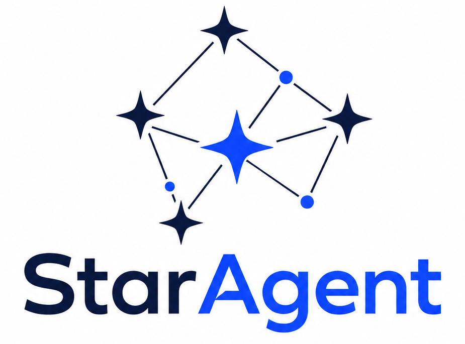
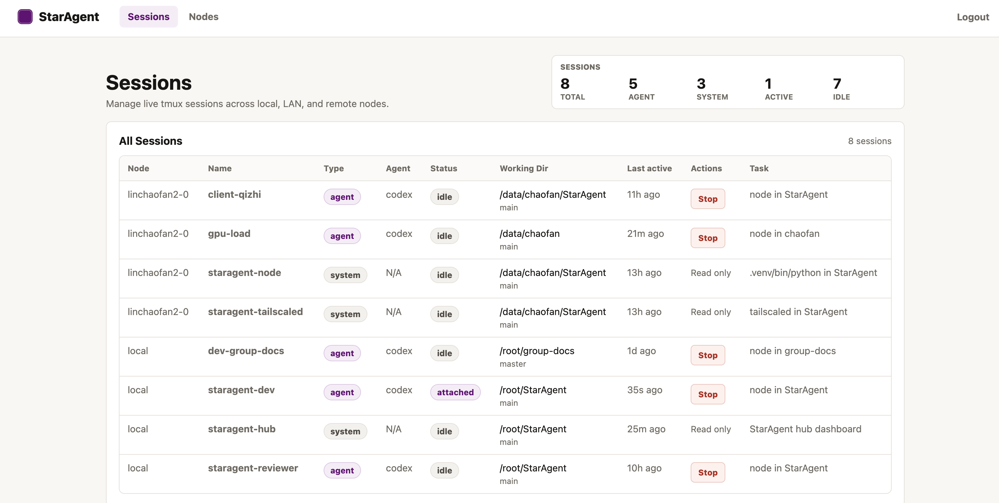
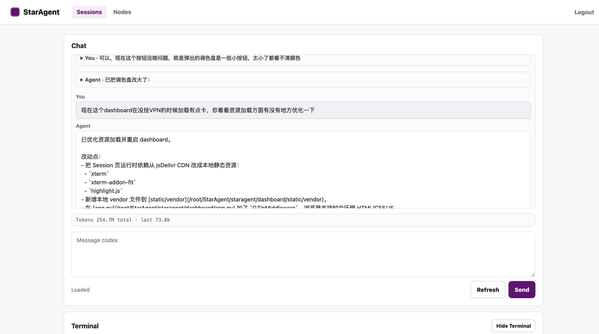

<h1 align="center">StarAgent</h1>

<p align="center">
  
</p>

> ⚠️ This project is currently intended for personal use and is under active development. A stable version will be released later.

> ⚠️ This project was primarily built with vibe coding and may contain potential bugs. Please keep this in mind before using it.

StarAgent is an **agent multiplexer** for managing coding agent sessions across machines in a unified dashboard. It reflects my own best practices for using multiple agents:

> **We just need a lightweight tmux wrapper for Codex / Claude Code that supports cross-machine connections and can be accessed from any of my devices.**

## Design Principles

It is built around a few practical needs that show up when using coding agents day to day:

- We often run multiple agent CLI instances in parallel across different working directories, each handling a separate task. We need one place to check their status and interact with them in real time.
- We want to interact with our agents anywhere, anytime, and on any device. And the sessions should be consistent.
- Agent CLI sessions should be long-lived, so we do not need to keep typing `/resume`.

Based on hands-on experience, StarAgent uses the simplest effective stack for this workflow, making it feel like managing a small team of coding agents:

- **tmux-first**. All coding agent CLI sessions run inside long-lived tmux sessions. For consistency, system-level background services are also represented as tmux sessions. See [SESSIONS.md](SESSIONS.md) for the session model.

- **Cross-machine connectivity via Tailscale**. Tailscale provides a secure and unified network layer across machines. See [tailscale/README.md](tailscale/README.md) for the Tailscale setup.

- **Unified management through a web dashboard**. The web dashboard lets you control agents from any device with a browser, including phones and laptops, without installing extra software.

StarAgent uses a centralized architecture: the `StarAgent Hub` runs the web dashboard and also acts as a local node, while other machines connect as `StarAgent Nodes` over the same Tailscale network. Every node can launch agent sessions, all managed from one dashboard.
For the technical architecture, see [ARCHITECTURE.md](ARCHITECTURE.md).

## Preview

Managing your session in one place:



Each session includes a lightweight chat console for interacting with agents, plus a Terminal and File Explorer.



**NOTCE:** None of this gets in the way of manually SSHing into the server and attaching to the corresponding tmux session for development. The web interface is implemented entirely as a parser — the tmux CLI sessions on the server are always the ground truth.

## Hub

Run this on the machine that runs the dashboard:

```bash
pip install -e '.[dev]'
export STARAGENT_AUTH_TOKEN="$(python -c 'import secrets; print(secrets.token_urlsafe(32))')"
staragent hub --host 0.0.0.0 --port 8080
```

Open `http://<hub-node>:8080` and log in with `STARAGENT_AUTH_TOKEN`.
Runtime state defaults to `~/.local/state/staragent`; set `STARAGENT_STATE_DIR` to override it.

## Remote Node

Run this on each machine that should run agent sessions:

```bash
pip install -e '.[dev]'
export STARAGENT_NODE_TOKEN="<same token as the Hub>"
tmux new -ds staragent-node "staragent node --host 127.0.0.1 --port 8081"
```

Expose `127.0.0.1:8081` through your network layer, then add that reachable endpoint in the Hub dashboard.

## Acknowledgements

StarAgent's CLI transcript parsing is adapted from ideas and code in [botmux](https://github.com/deepcoldy/botmux). The dashboard visual style is inspired by the [Tailscale admin console](https://tailscale.com/). The web terminal uses [xterm.js](https://xtermjs.org/), and file preview highlighting uses [highlight.js](https://highlightjs.org/).

## License

MIT. See [LICENSE](LICENSE).
