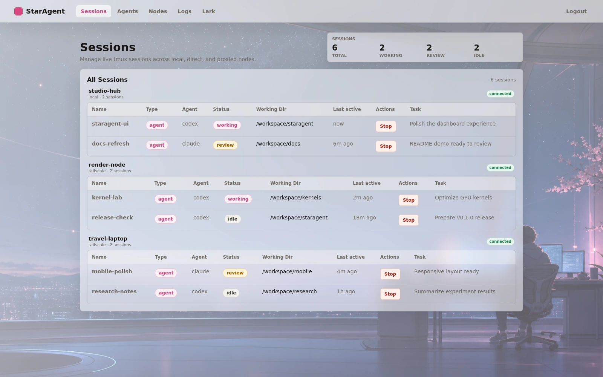
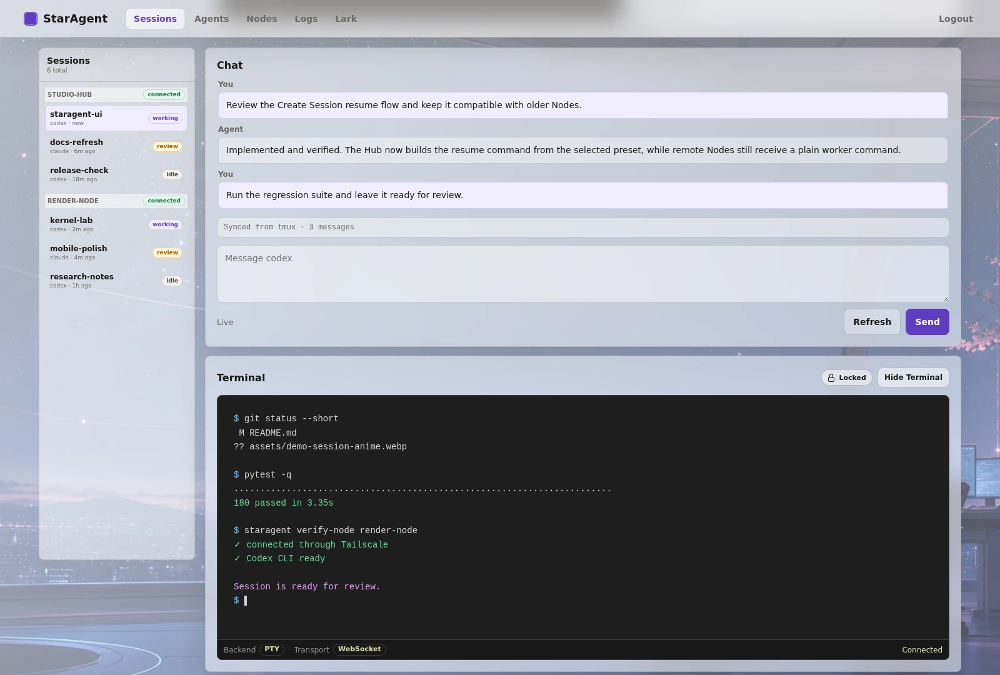
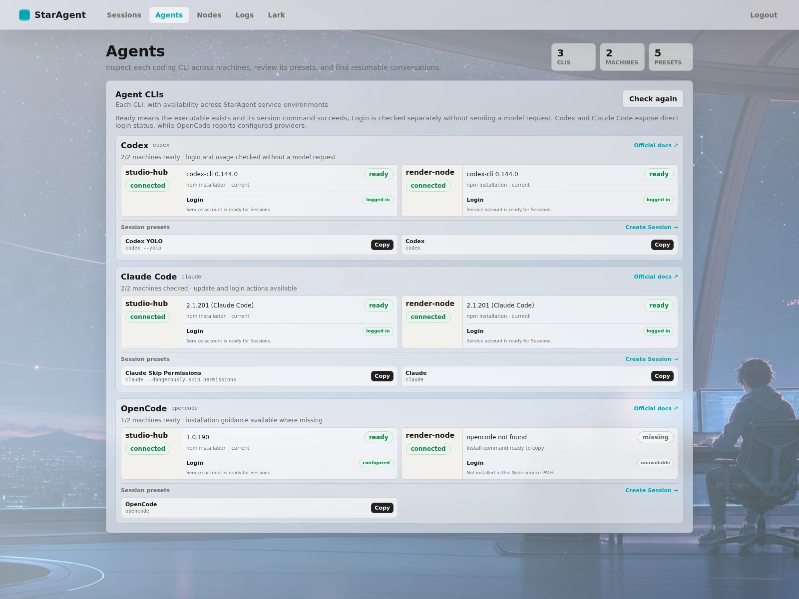

<h1 align="center">StarAgent</h1>

<p align="center">
  
</p>

<p align="center">
  <a href="README.md">English</a>
</p>

> ⚠️ 这个项目目前主要面向个人使用，仍在快速开发中。稳定版本会在后续发布。

> ⚠️ 这个项目主要由 vibe coding 构建，可能存在潜在问题，使用前请注意。

StarAgent 是一个 local-first 的 **Agent Harness Launcher**，同时也可以作为管理多个 Node 的 Hub。它来自我自己并行使用多个 agent 的实践：

> **我们需要一个轻量的持久终端 wrapper，用来管理 Codex / Claude Code，支持跨机器连接，并且能从任意设备访问。**

## 设计原则

StarAgent 围绕日常使用 coding agent 时最常见的几个需求构建：

- 我们经常会在不同 working directory 里并行运行多个 agent CLI，每个 agent 处理一个独立任务。因此需要一个地方统一查看状态，并实时交互。
- 我们希望随时随地、在任意设备上和 agent 交互，并且 session 状态保持一致。
- Agent CLI session 应该长期存在，这样就不需要反复输入 `/resume`。

基于实际使用经验，StarAgent 采用了对这个工作流足够简单、有效的技术栈，让它像是在管理一个小型 coding agent 团队：

- **使用平台原生的持久终端**。Windows Desktop 通过 ConPTY 承载 Session；Linux、macOS 与服务器 Node 继续使用长期存在的 tmux session。Session 模型见 [SESSIONS.md](SESSIONS.md)。

- **通过 Tailscale 实现跨机器连接**。Tailscale 提供安全、统一的跨机器网络层。配置方式见 [tailscale/README.md](tailscale/README.md)。

- **通过 Web Dashboard 统一管理**。Web Dashboard 让你可以从任何带浏览器的设备控制 agent，包括手机和电脑，不需要额外安装客户端。

直接运行 `staragent` 会打开只属于当前机器的 `StarAgent Launcher`。需要跨机器管理时再运行 `staragent hub`：先选择 Node，然后进入与 Launcher 完全共用的 Node 工作区。
技术架构见 [ARCHITECTURE.md](ARCHITECTURE.md)。

## 预览

以下截图使用的是脱敏 demo 数据。二次元风格背景完全可选：可以从主题菜单上传任意图片，
再搭配主题色与玻璃面板效果。

先选择一个已连接的 Node，再在独立工作区中管理这台机器上的 session：



每个 session 都包含一个轻量 Chat 控制台，用来和 agent 交互，同时也提供 Terminal 和 File Explorer。
Session 详情页左侧提供类似 IM 的会话切换栏，可以直接切换同一 Node 上的 session，
不需要先返回列表；窄屏设备上会折叠成抽屉。



查看所选 Node 上 Agent CLI 的可用性、登录状态、升级方式和启动 preset：



**注意：** 在 Linux/macOS Node 上，仍可手动 SSH 到服务器并 attach 对应 tmux session；Windows Desktop 则由内置 runtime 持有原生 ConPTY session。两种情况下，关闭浏览器或工作区页面都只是 detach，不会停止 Agent session。

## Launcher

在源码 checkout 中安装后，不带子命令直接启动：

```bash
pip install -e .
staragent
```

Launcher 默认运行在受监督的 `staragent-launcher` tmux system session 中，并打开
`http://127.0.0.1:8080` 的本机 Harness 工作区。通过 SSH 启动时只打印 URL，不会尝试打开
远端机器的浏览器；也可以显式使用 `staragent --no-open`。

Launcher 是默认的单机形态，启动后直接进入本机 Agents/Harness 目录。Sessions、Logs、
Settings 和 Current Node 详情页与 Hub 中选中一个 Node 后看到的是同一套页面。

## 桌面版

项目现在提供基于 Tauri 的 Windows、Linux 与 macOS 桌面应用，可以启动本机 Launcher，
也可以连接已有 Hub。Windows 安装包内置 StarAgent Python runtime，并使用 Windows 原生
ConPTY 承载终端与持久 Session；无需安装 WSL、Python 或 tmux。

### 下载预编译安装包

打开 [GitHub 最新 Release](https://github.com/SiriusNEO/StarAgent/releases/latest)，展开
**Assets**，按系统下载：

| 系统 | Release 文件 | 安装方式 |
| --- | --- | --- |
| Windows x64 | `*-setup.exe` | 运行当前用户安装程序 |
| Linux x64 | `*.AppImage` | 添加可执行权限后直接运行 |
| Debian / Ubuntu x64 | `*.deb` | 执行 `sudo apt install ./<下载的文件>.deb` |
| macOS Intel / Apple Silicon | `*.dmg` | 打开 Universal DMG，将 StarAgent 拖入 Applications |

GitHub 自动生成的 **Source code** 压缩包不是桌面安装包。如果某个旧 Release 只有这两个源码
压缩包，说明它早于桌面版打包流程；请改用更新版本、CI Artifact，或使用上面的源码安装方式。
`v0.1.1` 及更早版本不包含桌面安装包。

支持 updater 的桌面版本提供 **Stable** 和 **Nightly** 通道，并会在启动时检查当前选择。Stable
跟随正式 Release，Nightly 跟随相关 `dev` commit 的签名构建。发现新版后会展示版本、源码 commit
和 Release Notes，只有确认**更新并重启**后才开始安装。如果当前安装早于 updater 功能，需先手动
安装一次首个支持自动更新的版本。

也可以通过 [GitHub CLI](https://cli.github.com/) 下载同一份 Release 文件：

```bash
# Linux AppImage 示例；其他系统可将 pattern 换成 '*.deb' 或 '*.dmg'。
gh release download --repo SiriusNEO/StarAgent --pattern '*.AppImage'
```

如果想体验尚未发布的开发版，可以直接在应用中选择 Nightly。每次构建仍会保留在
[Desktop workflow](https://github.com/SiriusNEO/StarAgent/actions/workflows/desktop.yml) 的
`staragent-windows-x64`、`staragent-linux-x64` 与 `staragent-macos-universal` Artifact 中；直接下载
Actions Artifact 需要登录 GitHub。

Release 的 updater 产物带有 Tauri 更新签名，但操作系统发行者签名仍待补充，因此仍可能出现“未知
发行者”提示。Windows 本机模式已自包含；Codex、Claude Code 等 Agent Harness CLI 仍是按需组件，
可直接在 Agents 页面通过 Windows 原生路线安装，不会额外加入 Node.js/npm。npm 官方源和国内镜像
仍作为系统已有 npm 时的显式备用项。Linux/macOS 本机模式仍使用系统中的 StarAgent CLI 与 tmux。
运行时、自动更新、构建和签名细节见
[DESKTOP.zh-CN.md](DESKTOP.zh-CN.md)。

## Hub

在运行 Dashboard 的机器上执行：

```bash
pip install -e .
staragent hub --host 0.0.0.0 --port 8080
```

`staragent hub` 默认会创建 `staragent-hub` 这个 tmux system session。
打开 `http://<hub-node>:8080`，使用 `staragent hub` 打印出来的 token 登录。

认证与状态目录、Dashboard 页面、集中日志、Agent CLI 检测、国内镜像安装与升级、额度信息、preset
和历史会话恢复等详细说明见 [HUB.md](HUB.md)。

## Remote Node

在每台需要运行 agent session 的机器上执行：

```bash
pip install -e '.[dev]'
export STARAGENT_NODE_TOKEN="<same token as the Hub>"
sudo tailscale up --ssh
staragent node-ts --sudo
```

`staragent node-ts` 会检查 Tailscale 是否已经安装并连接，然后启动 `staragent-node` 这个 tmux system session，并配置 `tailscale serve`。
如果 Tailscale 还没有准备好，它会打印需要先执行的 `tailscale up --ssh` 命令。
当 `tailscale serve` 需要 root 权限时，请使用 `--sudo`。

如果你使用 LAN 或其他不需要 `tailscale serve` 的网络层，可以执行：

```bash
staragent node
```

添加 Node 之前，先在 Hub 机器上验证连通性：

```bash
staragent verify-node <node-host-or-100.x-ip>
```

然后在 Hub Dashboard 里添加可访问的 Host 和 Port，例如 `100.x.x.x` 和 `8081`。
如果 Node 使用非默认端口，请显式填写对应端口，例如 `8082`。

## 致谢

StarAgent 的 CLI transcript parsing 借鉴并改造了 [botmux](https://github.com/deepcoldy/botmux) 的思路和代码。Launcher 的本机浏览器、SSH 与 `--no-open` 启动行为参考了 [DeepSeek Harness](https://github.com/deepseek-ai/deepseek-harness)。Dashboard 视觉风格受到 [Tailscale admin console](https://tailscale.com/) 启发。Markdown Preview 遵循 [GitHub Flavored Markdown](https://github.github.com/gfm/) 的常见约定。Web terminal 使用 [xterm.js](https://xtermjs.org/)，文件预览高亮使用 [highlight.js](https://highlightjs.org/)。

## License

MIT. See [LICENSE](LICENSE).
