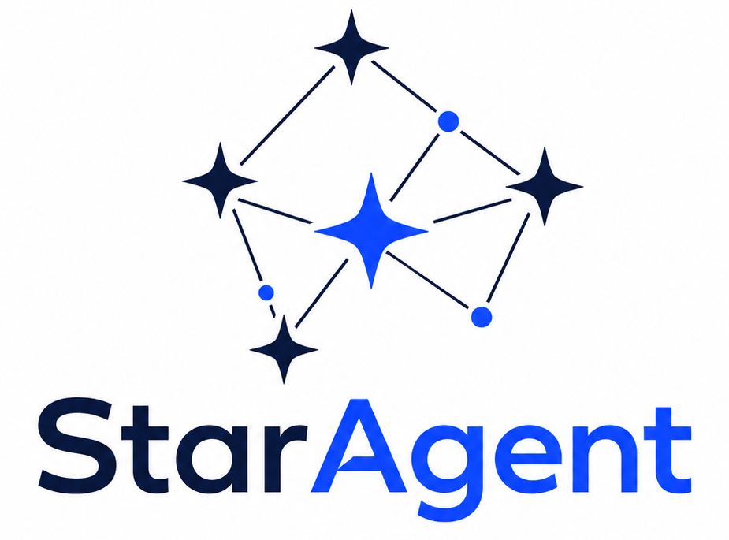
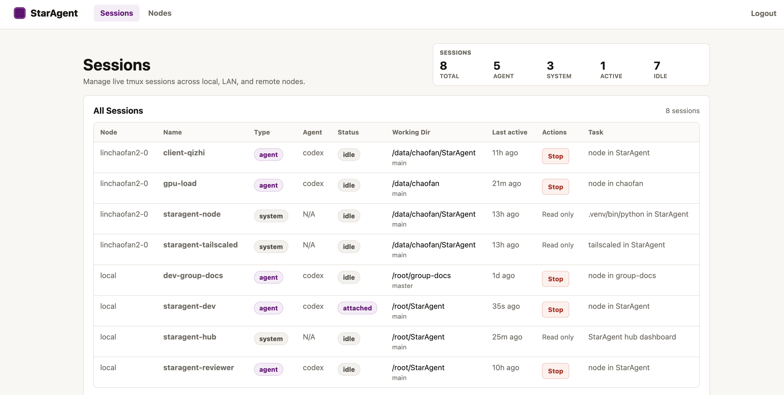
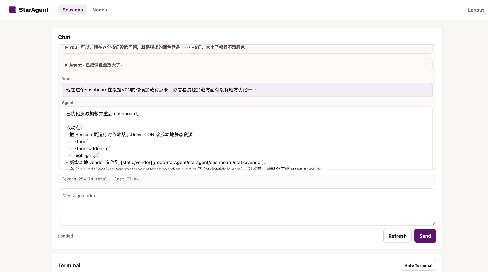

<h1 align="center">StarAgent</h1>

<p align="center">
  
</p>

<p align="center">
  <a href="README.md">English</a>
</p>

> ⚠️ 这个项目目前主要面向个人使用，仍在快速开发中。稳定版本会在后续发布。

> ⚠️ 这个项目主要由 vibe coding 构建，可能存在潜在问题，使用前请注意。

StarAgent 是一个用于统一管理跨机器 coding agent session 的 **agent multiplexer**。它来自我自己并行使用多个 agent 的实践：

> **我们需要一个轻量的 tmux wrapper，用来管理 Codex / Claude Code，支持跨机器连接，并且能从任意设备访问。**

## 设计原则

StarAgent 围绕日常使用 coding agent 时最常见的几个需求构建：

- 我们经常会在不同 working directory 里并行运行多个 agent CLI，每个 agent 处理一个独立任务。因此需要一个地方统一查看状态，并实时交互。
- 我们希望随时随地、在任意设备上和 agent 交互，并且 session 状态保持一致。
- Agent CLI session 应该长期存在，这样就不需要反复输入 `/resume`。

基于实际使用经验，StarAgent 采用了对这个工作流足够简单、有效的技术栈，让它像是在管理一个小型 coding agent 团队：

- **tmux-first**。所有 coding agent CLI session 都运行在长期存在的 tmux session 里。为了保持一致，系统级后台服务也会表示为 tmux session。Session 模型见 [SESSIONS.md](SESSIONS.md)。

- **通过 Tailscale 实现跨机器连接**。Tailscale 提供安全、统一的跨机器网络层。配置方式见 [tailscale/README.md](tailscale/README.md)。

- **通过 Web Dashboard 统一管理**。Web Dashboard 让你可以从任何带浏览器的设备控制 agent，包括手机和电脑，不需要额外安装客户端。

StarAgent 使用中心化架构：`StarAgent Hub` 运行 Web Dashboard，同时也作为本机 Node；其他机器作为 `StarAgent Node` 通过同一个 Tailscale 网络接入。每个 Node 都可以启动 agent session，并统一由一个 Dashboard 管理。
技术架构见 [ARCHITECTURE.md](ARCHITECTURE.md)。

## 预览

在一个地方管理所有 session：



每个 session 都包含一个轻量 Chat 控制台，用来和 agent 交互，同时也提供 Terminal 和 File Explorer。



**注意：** 这不会影响你手动 SSH 到服务器并 attach 到对应 tmux session 进行开发。Web 界面本质上只是 parser；服务器上的 tmux CLI session 始终是 ground truth。

## Hub

在运行 Dashboard 的机器上执行：

```bash
pip install -e '.[dev]'
staragent hub --host 0.0.0.0 --port 8080
```

`staragent hub` 默认会创建 `staragent-hub` 这个 tmux system session。
打开 `http://<hub-node>:8080`，使用 `staragent hub` 打印出来的 token 登录。
Hub 认证信息会保存在 `<staragent-source>/.staragent/auth_token`；如果你希望自己指定 token，可以在启动 Hub 前设置 `STARAGENT_AUTH_TOKEN`。
运行状态默认保存在 `<staragent-source>/.staragent`；如果需要覆盖，可以设置 `STARAGENT_STATE_DIR`。

## Remote Node

在每台需要运行 agent session 的机器上执行：

```bash
pip install -e '.[dev]'
export STARAGENT_NODE_TOKEN="<same token as the Hub>"
sudo tailscale up --ssh
staragent node-ts --sudo
```

`staragent node-ts` 会检查 Tailscale 是否已经安装并连接，然后启动 `staragent-node` 这个 tmux system session，并配置 `tailscale serve`。
如果 Tailscale 还没有准备好，它会打印需要先执行的 `tailscale up --ssh` 命令。
当 `tailscale serve` 需要 root 权限时，请使用 `--sudo`。

如果你使用 LAN 或其他不需要 `tailscale serve` 的网络层，可以执行：

```bash
staragent node
```

添加 Node 之前，先在 Hub 机器上验证连通性：

```bash
staragent verify-node <node-host-or-100.x-ip>
```

然后在 Hub Dashboard 里添加可访问的 Host 和 Port，例如 `100.x.x.x` 和 `8081`。
如果 Node 使用非默认端口，请显式填写对应端口，例如 `8082`。

## 致谢

StarAgent 的 CLI transcript parsing 借鉴并改造了 [botmux](https://github.com/deepcoldy/botmux) 的思路和代码。Dashboard 视觉风格受到 [Tailscale admin console](https://tailscale.com/) 启发。Markdown Preview 遵循 [GitHub Flavored Markdown](https://github.github.com/gfm/) 的常见约定。Web terminal 使用 [xterm.js](https://xtermjs.org/)，文件预览高亮使用 [highlight.js](https://highlightjs.org/)。

## License

MIT. See [LICENSE](LICENSE).
